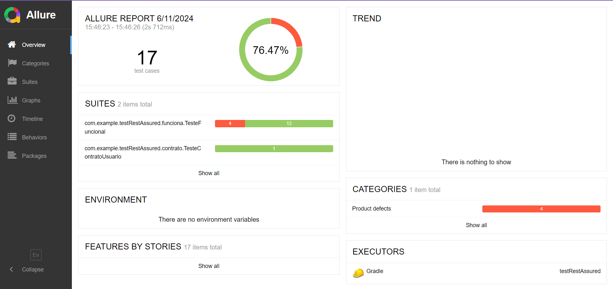

# TestRestAssured


## Descrição

Este projeto realiza testes automatizados utilizando RestAssured para validação da API de Votacao.

## 1-Pré-requisitos 

- java 17

- Gradle 

- Git 


## 2-Clonar o Repositório

1. Clone o repositório:
    ```bash
    git clone https://github.com/Lucca08/TestRestAssured.git
    cd TestRestAssured
    ```

## 3-Dependências

- testImplementation 'io.rest-assured:rest-assured:5.3.2'
- implementation 'io.rest-assured:json-schema-validator:5.4.0'
- testImplementation 'org.junit.jupiter:junit-jupiter-api:5.11.0-M2'
- testImplementation 'org.junit.jupiter:junit-jupiter-params:5.8.1'
- testImplementation 'org.slf4j:slf4j-simple:1.7.36' 
- testImplementation 'org.junit.jupiter:junit-jupiter-engine:5.11.0-M2'

## 4-Casos de Teste

[CenarioDeTest.md](CenarioDeTest.md)

## 5-Tabela de decisao

[Tabela De Decisao](TabelaDeDecisao.md)

## 6-Rode os testes 

1. Comando para rodar testes
    ```bash
    gradle test
    ```

## 7-Gerar Relatorio de Teste

1. Gere o relatório Allure:
    ```bash
    allure serve allure-results
    ```

## 8-Relatório gerado pelo Allure:



## 9-Allure bug

Rodandos os testes individualmente e mudando os ids manualmente, para o id da pauta que você gerou anteriormente nos testes, eles rodam certinho e passam em todos os testes, mas na hora de gerar o relatorio, o Allure conta eles como testes que não passaram, provavelmente por causa do banco de dados e da geração por id, mas todos os testes estão passando.